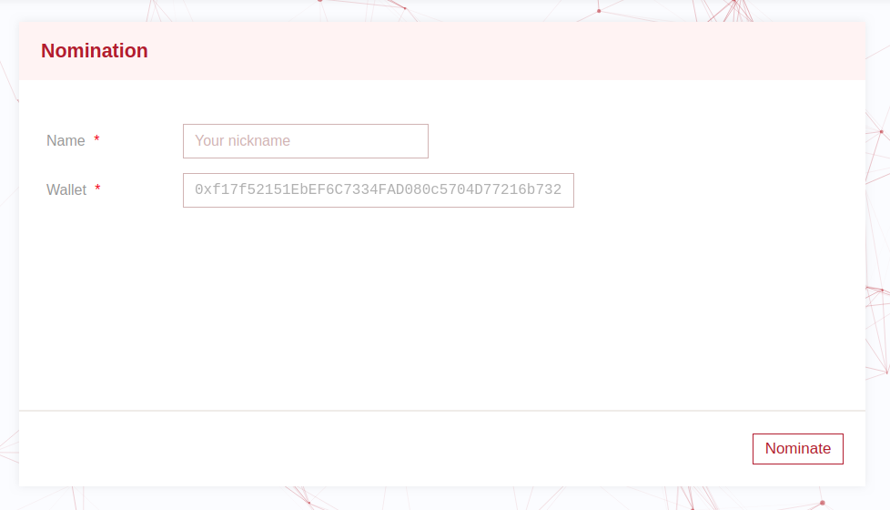
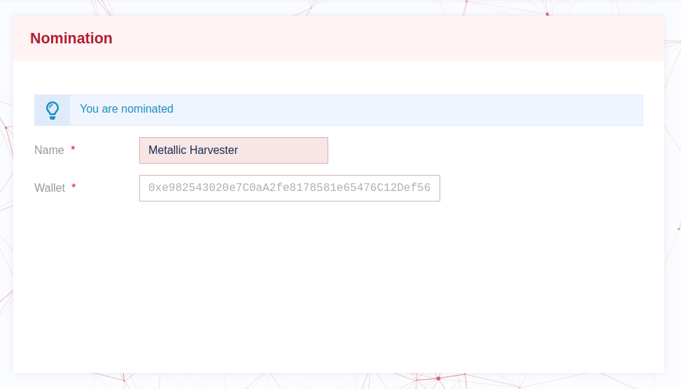
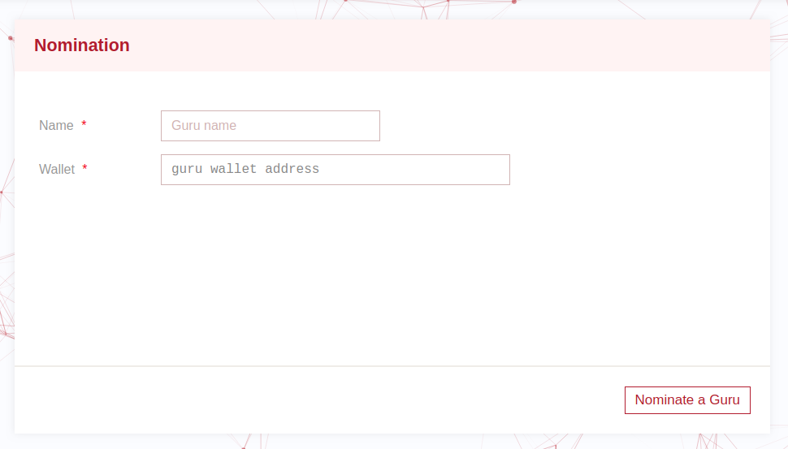
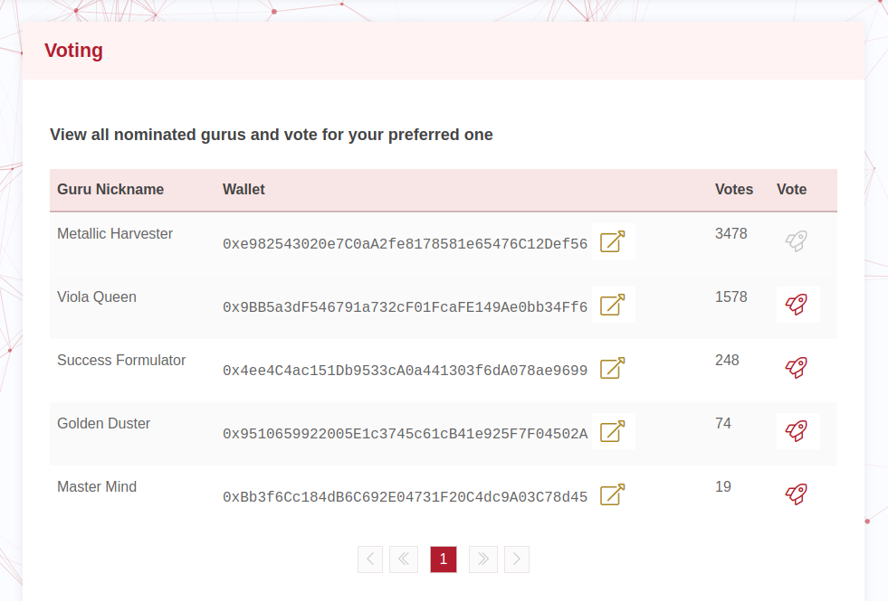

# InvestorX 

> ***Crypto in-Time Investment Collaboration ÐApp***

An Ethereum decentralized application for crypto-investment with decentralized suggestions and elections.

The ÐApp aims to elect top investment wallets. The elections run continuously, one election at a time. 

Voting for the best Gurus' wallets (technically the best investment Ethereum addresses) is **Forecasting** that is supposed to depend on technical due diligence and economic studies. And it should not be just subjective predictions. This encouraged by the DApp since the top Gurus will be the ones who really achieved the best investment strategies that are proven, by their ROIs, at the end of each election period.

# Actors

## Investment Guru

Those Guru supposed to be experienced crypto-investors, such that, every investor has a different collection of Ether and ERC20 tokens. Those gurus can submit as many wallets as different strategies they have. And they may submit their wallets(s) with a different or similar name(s) at each election cycle. 
The submitted wallet(s) of a guru will contain investment advice. That is the combination of Ether and Tokens that others are advised to follow. i.e. Other people are advised to have the same suggested percentage, of Ether and tokens, similar to the suggested wallets. 

## Follower / Voter

A follower is basically a voter who votes for the best wallet(s), that contain(s) the best investment recommendations. 

## Chairperson

This is the one who is responsible for opening and closing an election.

# Current Implementation 
Current smart contracts handle:

- Receiving Gurus' applications (names and wallets)
- Accepting votes from Followers
- Running (starting & closing) the election by Chairperson 

# Understanding the Low-level Execution Flow

Here is what you need to know to be able to run and test the Smart Contract:

- The Chairperson starts an election by calling `newElection`. If this is not the first election, the previous one has to be closed first.

- Any Guru can add his wallet, to the running election, by calling `beGuru` of the running `Election` contract. And he can repeat this for as many wallets as strategies he/she has.

- A Follower can repetitively vote for an investment wallet of a Guru, during the current election period, by calling `vote` of the in-use `Election` contract instance. 
Assumption: A voter can vote for more than one wallet. However, a voter cannot vote for the same wallet more than once. And the given vote cannot be undone (this can be changed easily if needed).

- The Chairperson can close the current election by calling `closeCurrentElection`. This is before a new election cycle can start.

# Testing
Running `truffle test` in the Terminal should output something like:
		
	Contract: Election
	✓ At deployment, the ElectionOpened event should be emitted
	✓ At deployment, the Election should be opened by default
	✓ Anyone should be able to add himself/herself as a guru
	✓ The chairperson should be able to add a guru
	✓ Followers can vote for gurus' wallets
	✓ Chairperson can close the Election
	✓ Followers cannot vote after the Election ends

	Contract: ElectionBase
	✓ At deployment, the deployer has to be set as the Chairperson
	✓ The chairperson should be updatable
	✓ The chairperson should not be updated by anyone other than the owner
	✓ Calling 'pause' should pause execution at ElectionBase
	✓ Unpause should allow execution again on ElectionBase

	Contract: ElectionFactory
	✓ ElectionFactory can deploy a new Election contract
	✓ New Election cannot be added before the current Election is closed
	✓ Election Factory can close the current Election
	✓ Deploying new Election Contract after closing the previous Election
	✓ Adding compatible Election after closing the current Election

Note: `ElectionBase` is the base contract for both `Election` and `ElectionFactory`. And it is not supposed to be deployed alone. However, a version is deployed to apply test cases.

# Running the website

**Used Versions**

 - Truffle v5.0.2
 - Solidity v0.5.0
 - Angular v7.1.0
 - Node v8.11.2
 - NPM v6.8.0 
 
**Installation, Deployment and Running Steps**

Follow those steps in-order:
 - Be sure to have the folder name exactly like this:
> investorX
Note: the folder name has to be exactly `investorX-angular-truffle` or else, the Angular will not work and the website will show an [error](https://stackoverflow.com/questions/54309107/after-renaming-angular-folder-i-got-the-error-you-seem-to-not-be-depending-on).

 - At the project folder "investorX-angular-truffle", open the Terminal and type the following:

   - To install the node_modules:
   
		`npm install`
    
   - To deploy the smart contracts:
   
		`truffle migrate --reset`
    
   - To run the website (this will open the default browser):
   
		`ng serve --open`

# Exploring the Website
The website will show the current active wallet at the top of the page bellow the banner. It will read it from the injected Web3. So, if you are using MetaMask, it will show a popup requesting your approval to connect.

The current implementation of the website contains the following pages:
 - **Nomination**
 Viewing this page depends on the wallet authorization. 
	- For normal users: They can nominate themselves to be Gurus.
	- For Chairperson: They can nominate others by adding there names and wallets.
	To view the UI differences, change the wallet at MetaMask form a normal account to the Factor Chairperson, and vice versa. The page will have an immediate react to the account change.
	
Bellow is how the page look like, when first opened by anyone other than the chairperson:

If the user nominate himself/hereself, the page look will display:

And here is who the page react differently to the chairperson:

 - **Voting**
 It contains a list of all Gurus with the ability to vote for any of them.
 

 
 - **Election Management** 
 This is just a demonstrative page that will be only shown for the ElectionFactory chairperson. So, to view it at your test development environment, use the same wallet that deployed the smart contract. (If you are using Ganache 5, at MetaMask import an account with this private key: 0x6c4c683787bee69235c4156d9ee495c4914fd6106514d565cdeb3fd9ddbe5b6c)

# Future Work
To have a complete project, some few more things have to be done like:
 - Some Oracles have to be implemented to provide the Ether and tokens' prices and overall values of each wallet during and at the end of each competition cycle. In order for the Smart Contract to be able to calculate the ROI (Return on Investment).
 - The Chairperson role can be automated or replaced by some Smart Contract as follow:
Suggestion 1: Set the Chairperson to be another smart contract where the logic of opening and closing an election cycle is, for example, could be triggered by anyone but verified against some rules (ex. based on time).  
Suggestion 2: remove the Chairperson logic and make the smart contract depend on time sluts and store the Gurus and votes in a mapping indexed by a number that is calculated based on time. For example, to make the period last for 3 months: 

	    batchNumber = (in seconds: timeNow - initialStratTime) / totalSecondsIn3Months

## Incentives to be implemented
The following could be considered:
 - Providing incentives for investors in order to encourage them join the completion. This can be done if a reward is given to the wallets that have the top ROI at the end of each election.

 - Followers, how votes for the top investment strategist (top ROI), has to be rewarded back also.

 - Contributors, voters and possible investors, has to pay in Ether or possibly using some specially issued ERC20 token in order to be able to participate. And the collected money will be used to reward the top investors after deducting some fees.

# Supportive files
The following files contains some additional information:

 - [Avoiding Common Attacks](./avoiding_common_attacks.md): A list of common attacks and how the risks has been mitigated.
 - [Design Pattern Desicions](./design_pattern_desicions.md): Explains some of the design decisions made.
 - [Deployed Addresses.txt](./deployed_addresses.txt): Describes where the deployed testnet contracts live (the code is verified with EtherScan).
